Using Python and ImageMagick, image files are arranged in tiles according to certain rules.

## Prerequisite:

- **With some exceptions, the image files must have the same vertical and horizontal dimensions.**  
The image size is checked in the script.
- **Install ImageMagick beforehand.**  
I am not using Python's ImageMagick library, but am using `subprocess.run(['magick', ...], ...)`.  
It uses ImageMagick ver.7 syntax.


## Usage:

I think it would be better to create a batch file and run it rather than specifying the files one by one from the console and executing them in real time.  
Check [`create_tiles.sh`](./create_tiles.sh).

|Argument|Required|Default|Description|
|---|---|---|---|
|`-i`, `--input`|Required||The order has meaning, files are not checked for existence|
|`-o`, `--output`|Required|||
|`-tt`, `--tyling_type`|Required||`6tiles`, `5tiles`, `4tiles`, `landscape`, `portrait`|
|`-gs`, `--gap_size`|Optional|`10`||
|`-gc`, `--gap_color`|Optional|`#00000000`||
|`-di`, `--direction`|Optional|`NE`|Direction, `NW`(default), `NE`, `SE`, `SW`, valid only when the `--tyling_type` value is `5tiles` or `6tiles`, ignored otherwise|


### 6 tiles

All images must be the same size in both width and height.

|`NW`|`NE`|`SE`|`SW`|
|--|--|--|--|
|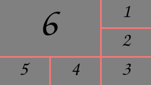|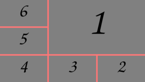|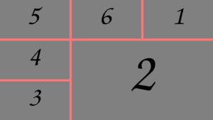|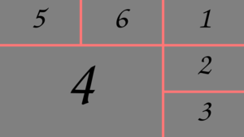|

```
python3 ./create_tiles.py \
  --input \
    ./sample1.png \
    ./sample2.png \
    ./sample3.png \
    ./sample4.png \
    ./sample5.png \
    ./sample6.png \
  --output ./tiles6_NW.png \
  --tyling_type 6tiles \
  --gap_size 20 \
  --gap_color '#72170faa' \
  --direction NW
```


### 5 tiles

All images must be the same size in both width and height.

|`NW`|`NE`|`SE`|`SW`|
|--|--|--|--|
|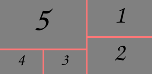|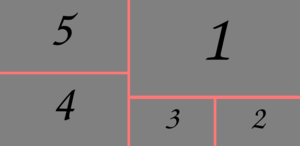|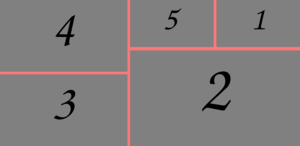|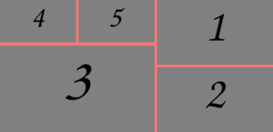|

```
python3 ./create_tiles.py \
  --input \
    ./sample1.png \
    ./sample2.png \
    ./sample3.png \
    ./sample4.png \
    ./sample5.png \
  --output ./tiles5_NW.png \
  --tyling_type 5tiles \
  --gap_size 20 \
  --gap_color '#72170faa' \
  --direction NW
```


### 4 tiles

All images must be the same size in both width and height.

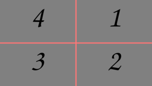

```
python3 ./create_tiles.py \
  --input \
    ./sample1.png \
    ./sample2.png \
    ./sample3.png \
    ./sample4.png \
  --output ./tiles4.png \
  --tyling_type 4tiles \
  --gap_size 20 \
  --gap_color '#72170faa'
```


### Landscape

All images must be the same height.

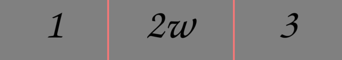

```
python3 ./create_tiles.py \
  --input \
    ./sample1.png \
    ./sample2w.png \
    ./sample3.png \
  --output ./tiles_landscape.png \
  --tyling_type landscape \
  --gap_size 20 \
  --gap_color '#72170faa'
```


### Portrait

All images must be the same width.

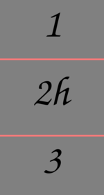

```
python3 ./create_tiles.py \
  --input \
    ./sample1.png \
    ./sample2h.png \
    ./sample3.png \
  --output ./tiles_portrait.png \
  --tyling_type portrait \
  --gap_size 20 \
  --gap_color '#72170faa'
```


<!-- -->
